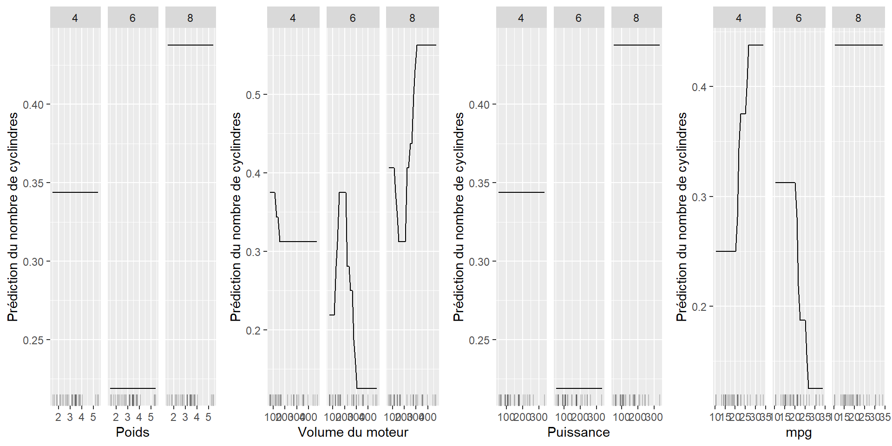

#Graphique de dépendance partielle (PDP)
##Définition
Le graphique de dépendance partielle permet de comprendre les variables importantes dans un modèle donné. Effectivement, le PDP permet d'examiner la relation entre une variable explicative (voire deux) et le modèle à expliquer pour lequel nous calculons des prédictions.  
Supposons que l'on souhaite comprendre l'importance d'une variable dans un modèle donné. Le PDP construit le modèle en faisant la moyenne des autres variables prédictives, à l'exception d'une variable prédictive choisie : il peut aider à identifier comment une variable affecte notre modèle. En effet, si l'on observe un plateau sur le PDP alors pour les valeurs associées la variable n'est pas utilisée pour prédire : elle n'a pas d'effet dans le modèle.     
  
Soit $x_S$ une variable pour laquelle le PDP va être tracé, cette variable est donc fixée. En général, dans l'ensemble de $S$ il n'y a qu'une ou deux caractéristiques. Ces caractéristiques sont celles pour lesquelles on veut connaître l'effet sur la prédiction.  
Soit $x_C$ toutes les autres variables utilisées dans le modèle de machine learning, ce sont donc ces variables que nous allons faire varier.  
Soit $\hat{f}$ la boîte noire que l'on cherche à expliquer.  
  
On définit la fonction de dépendance partielle par :  
$$
\hat{f}_{x_S}(x_S) = \mathbb{E}[\hat{f}(x_S, x_C)] = \int \hat{f}(x_S,x_C) d\mathbb{P}(x_C)
$$

###Exemple {-}
Soit $x = x_S$ et $z = x_C \in \{0,1\}$.
$$
\mathbb{E}_z[\hat{f}(x,z)] = \hat{f}(x,0)\mathbb{P}(z=0) + \hat{f}(x,1)\mathbb{P}(z=1) \\
=\hat{f}(x) \text{ : fonction qui dépend de x}
$$
En réalité, $\hat{f}(x)$ définie comment $\hat{f}$ dépend en "moyenne" de $x$, c'est à dire quand l'on fait varier toutes les autres variables.  
  
On définit maintenant la méthode de `Monte Carlo`.
$$  
\mathbb{E}[g(X)] = \int g(x)F(x)dx \text{ où } F(x) \text{ densité de } X  
$$
  Pour estimer cette espérance, on peut :  
- tirer $x_1,...,x_n$ selon $F$  
- calculer $g(x_1),...,g(x_n)$  
- $\hat{\mathbb{E}}[g(x)] = \frac{1}{n} \sum_{i=1}^n g(x_i)$  
  
A l'aide de la méthode de Monte Carlo, nous pouvons définir la fonction partielle $\hat{f}(x_S)$ qui est estimée en calculant les moyennes dans les données d'entraînement : 
$$
\hat{f}_{x_S}(x_S) = \frac{1}{n}\sum_{i=1}^n \hat{f}(x_S, x_C^{(i)})
$$
  Cette fonction nous indique pour une ou plusieurs valeurs données de $S$ quel est l'effet marginal moyen sur la prédiction.  
Ici, les $x_c^{(i)}$ sont les valeurs réelles des caractéristiques de l'ensemble de données pour les caractéristiques qui ne nous intéressent pas, et n est le nombre d'occurrences dans l'ensemble de données.  

###Cas particulier {-}
Dans le cas particulier où notre modèle n'est pas une boîte noire, la méthode de Monte Carlo illustre bien le fait que nous retombons sur quelque chose que nous connaissons déjà et donc il n'est pas nécessaire d'utiliser un PDP.  
Nous allons le confirmer avec le choix d'un modèle linéaire comme modèle de machine learning.  
  
Soient $\hat{f}(x,z) = a+bx+cz$ et $\psi$ la densité de $z$.  
$$
\int\hat{f}(x,z)\psi(z)dz = \int (a+bx+cz)\psi(z)dz \\
= a\int\psi(z)dz + bx\int\psi(z)dz + c\int z\psi(z)dz \\
= a + bx + c \mathbb{E}[z]
$$
  On utilise donc la méthode de Monte Carlo pour estimer $\mathbb{E}[z]$, et c'est quelque chose que l'on sait faire aisément.

##Avantages
Les graphiques de dépendance partielle sont faciles à implémenter et à interpréter.  

Ils fonctionnent pour les variables catégorielles.  

Si la variable pour laquelle vous avez calculé le PDP n'est pas corrélée avec les autres caractéristiques, alors les PDP représentent parfaitement comment la variable influence la prédiction en moyenne.

Le calcul des graphiques de dépendance partielle a une interprétation causale. Nous intervenons sur une fonctionnalité et mesurons les évolutions des prédictions. Ainsi, nous analysons la relation causale entre la caractéristique et la prédiction. La relation est causale pour le modèle (parce que nous modélisons explicitement le résultat en fonction des caractéristiques) mais pas nécessairement pour le monde réel.

##Inconvénients
En raison de techniques de visualisation limitées et de la restriction de la perception humaine à un maximum de trois dimensions, seules une ou deux caractéristiques peuvent raisonnablement être affichées dans un PDP.  

Le PDP repose sur une hypothèse d’indépendance entre les variables, qui est rarement vérifiée en pratique.
Si les variables sont corrélées entre elles, la fonction de dépendance partielle produira des points de données irréalistes (par exemple il est peu probable qu'une personne qui mesure 2 mètres pèse 50kg).
Nous avons donc, ici, deux problèmes :  

- Le premier problème est que le couple $(x,y_i)$ avec $x$ fixé soit invraisemblable : c'est à dire que ce n'est pas quelque chose qui représente la réalité. On peut résoudre ce problème en prenant un intervalle fixé de y qui se tient autour de $x$. Le **M-Plot** est donc une solution.  

- Le second problème est du à l'influence de $x$ sur $y$. On imagine que $x$ n'a pas d'influence dans la prédiction : on s'attend alors que le PDP soit constant. Mais si $y$ a de l'influence alors on observera un PDP non constant : cela constitue un problème. Afin de le résoudre, les graphiques **ALE** proposent une bonne solution.  

Le PDP masque les effets hétérogènes entre les variables, en effet, il ne montre que les effets marginaux moyens. Une solution à ce problème est le graphique **ICE** présenté plus loin dans ce chapitre.

##En `R`
En `R`, nous utilisons le package `iml` pour implémenter les graphique de dépendance partielle.
Ci-dessous nous pouvons trouver un exemple de code avec pour boite noire une forêt aléatoire :   
```{}
algo_FA = randomForest(formula, data, importance = TRUE)
predictor = Predictor$new(model = algo_FA, data)
pdp = FeatureEffect$new(predictor, feature, method = "pdp", grid.size = 30)

p1 = pdp$plot()

pdp$set.feature("nom variable")
p2 = pdp$plot()

gridExtra::grid.arrange(p1, p2, nol = 2)
```

Il existe aussi d'autres packages pour implémenter des PDP comme le package `pdp` ou bien `DALEX`.  
Du coté de `Python`, les PDP sont intégrés dans `scikit-learnet`.  

##Exemples
Il existe plusieurs méthodes de traitements pour les modèles de machine learning, on souhaite comparer pour un même jeu de données si les différents algorithmes nous renvoient aux même résultats et surtout essayer de comprendre quelle méthode de machine learning est le plus adaptée pour chaque data frame.  

###Exemple 1 : Utilisation de deux boites noires différentes comme modèles sur le jeu de données `weather`
Nous choisissons pour notre premier exemple le jeu de données `weather` du package `nycflights13`. Il représente les données météorologiques horaires pour les trois aéroports de New York : EWR, LGA et JFK.   
Nous allons commencer par implémenter une forêt aléatoire puis un algorithme SVM comme modèles de machine learning.
Nous voulons prédire la température (en Fahrenheit) des aéroports de New York et utiliser le diagramme de dépendance partielle afin de visualiser les relations que le modèle a apprises. L'influence des caractéristiques que nous avons choisies sur la température sont illustrés dans les figures suivantes.  


#### Construction du PDP avec comme boite noire une forêt aléatoire {-}
<div class="figure">

<p class="caption">(\#fig:unnamed-chunk-4)PDP pour le modèle de prédiction de la température dans les aéroports de New York avec la méthode des forêts aléatoires.</p>
</div>
  
En `figure 1`, nous obtenons un graphique de dépendance partielle où nous avons prédit la température (en F) dans les différents aéroports de New York avec comme modèle de boite noire une forêt aléatoire.   
On utilise ce graphique pour visualiser les relations que le modèle a apprises.  
Nous avons prédit la température à l'aide des variables `Point de rosée`, `Humidité`, `Vitesse du vent` en Miles par heure ainsi que les `Aéroports`.  
On rappelle que les marques sur l'axe des $x$ indiquent la distribution des données.  
On voit donc sur ces graphiques que :  

- Plus le point de rosée augmente, plus la température augmente. Ce qui paraît logique : la rosée apparaît le matin, là où les températures sont les plus faibles.  

- Plus l’humidité augmente, plus la température diminue. On remarque quand même à partir de 75-80% d'humidité un palier, ce qui indique que la température stagne.  

- Plus la vitesse du vent augmente, plus la température diminue. Ce qui paraît logique encore une fois. De plus, on remarque qu'à partir de 30 mph la température stagne.  

- Concernant la variable catégorielle `Aéroport`, on remarque que peu importe l'aéroport que l'on choisit, ils montrent un effet similaire sur les prévisions du modèle.  

####Visualisation de la dépendance partielle de deux fonctionnalités à la fois {-}
<div class="figure" style="text-align: center">

<p class="caption">(\#fig:unnamed-chunk-5)PDP de la prédiction de la température et l'intéraction de l'humidité et de la vitesse du vent.</p>
</div>
  
En `figure 2`, nous observons un graphique de dépendance partielle pour la prédiction de la température dans les aéroports de New York avec deux fonctionnalités qui sont l'`Humidité` et la `Vitesse du vent` avec pour modèle de machine learning une forêt aléatoire.  
Ce graphique nous montre que plus l'humidité augmente et plus la vitesse du vent augmente, alors la température diminue.  

#### Construction du PDP avec comme boite noire un algorithme SVM {-}
<div class="figure">

<p class="caption">(\#fig:unnamed-chunk-6)PDP pour le modèle de prédiction de la température dans les aéroports de New York avec la méthode SVM.</p>
</div>
  
Nous modélisons à l'aide d'un algorithme SVM notre PDP, de même que pour les conclusions obtenues via une forêt aléatoire, nous pouvons constater les mêmes informations qu'apporte chaque variable et ses effets sur la prédiction de la température :   

- Le point de rosée a un effet positif sur la prédiction de la température  
      
- L'humidité joue aussi son rôle puisqu'il y a une interaction négative avec la variable température   

- La vitesse du vent influence de manière positive la prédiction de la température   
       
- L'aéroport n'intervient dans la compréhension de la température puisqu'elle n'a aucun effet sur cette dernière


###Exemple 2 : Utilisation de deux boites noires différentes comme modèles sur le jeu de données `mtcars`
Nous choisissons pour notre second exemple la base de données `mtcars`, qui indique la consommation de carburant (en miles par gallon) de 32 automobiles (modèles 1973-74), à laquelle nous appliquons un modèle de machine learning : les forêts aléatoires.  
Nous voulons prédire le nombre de cylindres d'une voiture et utiliser le diagramme de dépendance partielle pour visualiser les relations que le modèle a apprises. L'influence des caractéristiques d'une voiture sur le nombre de cylindres prévus sont illustrées dans les figures suivantes.  
  


#### Construction du PDP avec comme boite noire une forêt aléatoire {-}
<div class="figure">

<p class="caption">(\#fig:unnamed-chunk-8)PDP pour le modèle de prédiction du nombre de cylindres d'une voiture en fonction de son poids, son déplacement, sa puissance et le rapport du pont arrière avec la méthode des forêts aléatoires.</p>
</div>
  
Il est important ici de se placer dans le contexte, nous essayons de prédire le nombre de cylindres présents dans une voiture à l'aide des autres variables présentes dans le dataframe. Comme le nombre de cylindres est fixé, nous avons donc dû créer une variable catégorielle pour classer chaque prédiction.  
Nous étudions variable par variable pour décrire leurs comportements.  
  
La variable `Poids`, pour chaque niveau, n'influence pas le cylindre d'un véhicule que l'on ait une voiture plus ou moins lourde : cela n'a pas d'importance.  
  
Pour ce qui est de la variable `Volume du moteur`, les probabilités d'affectation à un véhicule à quatre cylindres sont quasiment les mêmes quelque soit le volume du moteur. Il n'y a donc aucune interaction particulière.  
Pour affecter un véhicule à six cylindres, les probabilités diminuent lorsque le volume du moteur augmente : on note donc un effet négatif.  
En revanche, les voitures prédites avec huit cylindres voient leurs probabilités d'affectation augmenter via l'augmentation du volume du moteur : nous avons ici une interaction positive.  
  
Dans le cadre de la variable `Puissance`, pour des véhicules prédits à quatre cylindres il n'existe pas de lien pouvant affirmer que l'augmentation de la puissance implique une prédiction des véhicules à quatre cylindres.  
En revanche, pour prédire un véhicule à six cylindres nous constatons que la puissance joue un rôle dans cette expérience. Lorsqu'elle augmente cela diminue la probabilité de prédire six cylindres dans un véhicule, on en conclut donc un lien négatif.  
Enfin, pour les grosses cylindrés nous constatons que les probabilités associées à la prédiction de huit cylindres augmentent lorsque la voiture est très puissante, c'est donc un effet positif qui s'exerce entre ces deux variables.  
  
Enfin avec la variable `mpg`, affecter un véhicule à quatre cylindres est impacté par l'augmentation de mpg. En effet, les probabilités de prédire quatre cylindres augmente au fur et à mesure que mpg s'élève aussi.
Pour six cylindres nous avons la conclusion inverse, les probabilités de prédire six cylindres diminuent en même temps que mpg.
En revanche pour les véhicules affecté à huit cylindres il n'y a aucune importance sur la valeur que peut prendre mpg, les probabilités sont les mêmes.  
  

####Construction du PDP avec comme boite noire un algorithme SVM{-}
<div class="figure">

<p class="caption">(\#fig:unnamed-chunk-9)PDP pour le modèle de prédiction du nombre de cylindres d'une voiture en fonction de son poids, son déplacement, sa puissance et le rapport du pont arrière avec la méthode SVM.</p>
</div>
   
De même que pour le traitement précédent nous construisons aussi un PDP à l'aide de l’algorithme SVM.  
Dans l'hypothèse de savoir si nous obtenons les mêmes informations nous analysons donc nos résultats.  
  
Nous reprenons donc notre analyse en nous intéressant au comportement de la variable `Poids`. Pour un véhicule de plus en plus lourd la probabilité de prédire quatre cylindres diminue elle aussi de plus en plus, nous avons donc le témoignage de l'effet de corrélation négatif.  
À contrario, pour la prédiction des véhicules de six et huit cylindres, plus leurs poids augmentent et plus leurs probabilités de prédire six ou huit cylindres augmentent.  
Dans l'idée général nous voyons que les grosses voitures impliquent d'avoir plus de cylindres.  
  
Ici, nous regardons l'impact des variables `Déplacement` et `Puissance`.  
Pour ce qui est des voitures prédites à quatre ou six cylindres, elles témoignent le même comportement. En effet, pour des déplacements plus grands les probabilités de prédire que tel véhicule à quatre ou six cylindres décroissent : ce qui met en évidence une influence négative.  
En revanche, pour les voitures prédites à huit cylindres c'est l'exact opposé, avec de nombreux déplacements cela croît la probabilité d'être affecté à un véhicule comprenant huit cylindres.  
Ici, on peut voir l'isolement des véhicules citadins standards et les véhicules apprêtés pour faire de gros déplacement.  
  
Pour ce qui est de la variable `mpg`, nous constatons une tendance positive pour prédire des voitures à quatre cylindres, plus on augmente mpg et plus l'on a de chance d'affecter une voiture à quatre cylindres.
Ce qui est tout le contraire pour prédire les véhicules à six et huit cylindres qui, eux, ont un effet négatif lorsque mpg augmente.


##Espérance conditionnelle individuelle (ICE)
###Définition
Un inconvénient du graphique de dépendance partielle est qu'il ne montre que les effets marginaux moyens, en effet il masque les effets hétérogènes entre les variables. Pour résoudre ce problème, il existe les tracés d'espérance conditionnelle individuelle (ICE).  
Les tracés ICE affichent une ligne pour chaque observation. Ils vont montrer comment la prédiction de l'observation varie lorsqu'une entité varie : c'est donc l'équivalent d'un PDP pour des observations de données individuelles. En conclusion, un PDP est la moyenne des lignes d'un graphique ICE. 

Une définition plus formelle serait : pour chaque $\{(x_S^{(i)}, x_C^{(i)})\}_{i=1}^n$ la courbe $\hat{f}_S^{(i)}$ est tracée contre $x_S^{(i)}$ tandis que $x_C^{(i)}$ reste fixé.

#### Avantages 
La méthode ICE, étant une dérivée du PDP, est plus facile à interpréter. En effet, sur le graphe est tracé les prédictions pour chaque instance. Cela permet aussi d'identifier les relations hétérogènes entre $x_S^{(i)}$. 

#### Inconvénients
Sur les modèles ICE comme nous avons plusieurs tracés sur les graphiques, il n'est par conséquent pas faisable d'ajouter une deuxième variable sur le graphe. Cela rendrait une lecture impossible car nous ne verrons rien suite aux nombreux tracés qui surchargent le graphique.  
  
De même que pour les traitements PDP, la méthode ICE nécessite aussi l'hypothèse d'indépendance des variables qui n'est pas vraiment vérifiée dans la pratique.  

####Programmation
En `R`, nous utilisons le package `iml` pour implémenter les tracés d'espérance conditionnelle individuelle (ICE).
Ci-dessous nous pouvons trouver un exemple de code avec pour boite noire une forêt aléatoire :   
```{}
algo_FA = randomForest(formula, data, importance = TRUE)
predictor = Predictor$new(model = algo_FA, data)
pdp = FeatureEffect$new(predictor, feature, method = "ice", grid.size = 30)

p1 = pdp$plot()

pdp$set.feature("nom variable")
p2 = pdp$plot()

gridExtra::grid.arrange(p1, p2, nol = 2)
```

Il existe aussi d'autres packages pour implémenter des ICE comme le package `pdp`, `ICEbox30`.  
Du coté de `Python`, les ICE sont intégrés dans `scikit-learnet`. 

###Exemple : ICE avec le jeu de données `weather` et comme boite noire une forêt aléatoire
<div class="figure">

<p class="caption">(\#fig:unnamed-chunk-10)ICE pour le modèle de prédiction de la température (en F) avec la méthode des forêts aléatoires.</p>
</div>
   
En `figure 6`, nous obtenons un tracé ICE où nous avons prédit la température (en F) dans les différents aéroports de New York avec comme modèle de boite noire une forêt aléatoire. Chaque ligne représente une température.  
Toutes les instances représentées dans le modèle ICE nous indiquent les mêmes informations que dans le modèle PDP :  

- Le point de rosée a toujours un effet positif sur la prédiction de la température   

- L'humidité joue aussi son rôle puisqu'il y a une tendance négative avec la variable température   
       
- La vitesse du vent influence de manière positive la prédiction de la température

