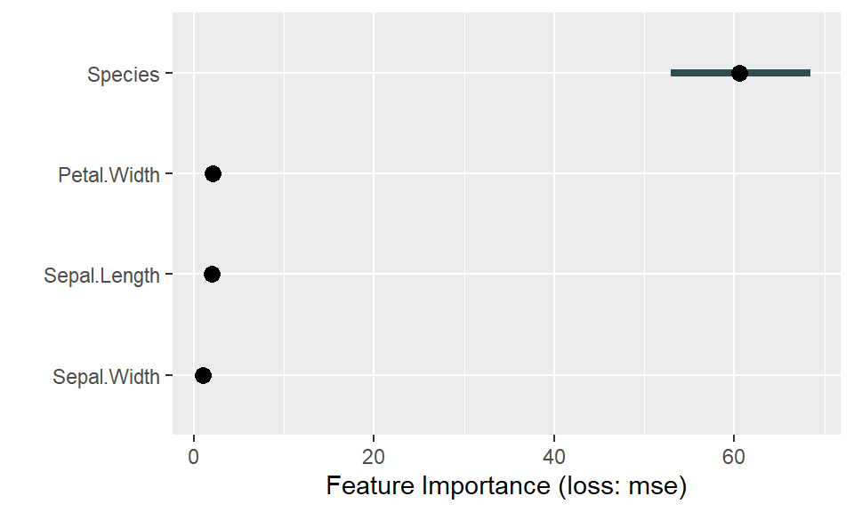
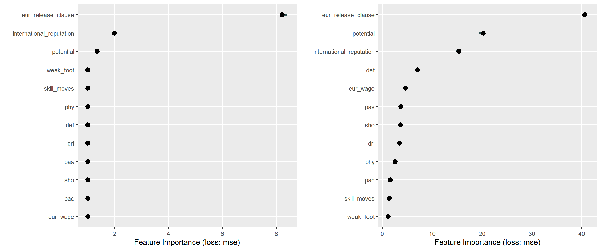

# Importance des variables dans les modèles prédictifs
## Définition
La fonction de permutation mesure l'augmentation de l'erreur de prédiction du modèle après la permutation des valeurs de la fonction, ce qui rompt la relation entre la fonction et le résultat réel. Son énorme avantage est qu’elle s’applique à n’importe quel type de modèle prédictif.    
Une caractéristique est *importante* si le mélange de ses valeurs augmente l'erreur du modèle, alors dans ce cas, le modèle s'est appuyé sur cette caractéristique pour la prédiction.  
Une fonction est *sans importance* si le mélange de ses valeurs laisse l'erreur de modèle inchangée, en effet dans ce cas, le modèle a ignoré la fonction pour la prédiction.   
En résumé, l'algorithme permet de modifier les valeurs des variables pour voir si l'erreur augmente ou diminue.
  
On introduit, ici, l'algorithme d'importance des caractéristiques de permutation basé sur Fisher, Rudin et Dominici (2018). Pour neutraliser la variable, ils préconisent de mélanger aléatoirement les valeurs à l’intérieur du vecteur et, par conséquent, de casser le lien qu’elle peut entretenir avec la classe à prédire (et les autres variables par la même occasion).  
On retranscrit l'algorithme :  
Entrée: modèle formé $f$, matrice de caractéristiques $X$, vecteur cible $y$, mesure d'erreur $L(y, f)$.   

1. Estimer l'erreur d'origine du modèle $e^{orig} = L(y, f(X))$ (par exemple, erreur quadratique moyenne)  

2. Pour chaque caractéristique $j = 1,...,p$ faire:
  - Générez une matrice de caractéristiques $X^{perm}$ en permutant la caractéristique $j$ dans les données $X$.
  Cela rompt l'association entre la caractéristique $j$ et le résultat réel $y$.  
  - Estimer l'erreur $e^{perm} = L(Y, f(X^{perm}))$ sur la base des prédictions des données permutées.  
  - Calculer l'importance de la fonction de permutation $FI^j = e^{perm} / e^{orig}$. 
  Alternativement, la différence peut être utilisée: $FI^j = e^{perm} - e^{orig}$.  
  
3. Trier les entités par $FI$ décroissante.

L’importance des variables peut être estimée en modélisation (sur l’échantillon d’apprentissage) ou en prédiction (sur l’échantillon test). Dans les deux cas, les principales étapes sont les mêmes : calculer le taux d’erreur de référence, calculer ensuite le même indicateur en neutralisant tour à tour chaque variable prédictive et enfin former le ratio entre les deux valeurs.  
  
L'idée de la permutation étant de mesurer l'erreur quadratique moyenne/absolue des prédictions qui ont été faites après permutation de l'ensemble des $X_1^{(i)}$ où $i = 1,..,n$. La fonction calcule plusieurs erreurs de prédiction pour une même variable dont les valeurs ont été affectées à d'autres individus $i$. Le but est de comparer si le mélange des valeurs provoque un effet sur l'erreur du modèle, donc savoir si l'on peut traduire le comportement d'une variable $Y$ affecté à une variable $X$ :  

- Le mélange des valeurs de $X_1^{(i)}$, provoquant une augmentation de l'erreur du modèle, traduit l'importance de $X_1$ car cela indique que le modèle s'est appuyé sur cette variable pour prédire $Y$.  

- Le mélange des valeurs de $X_1^{(i)}$, n'ayant aucun effet sur l’augmentation de l'erreur du modèle, montre qu'il n'y a eu aucune interaction pour la prédiction et donc n'intervient pas dans le traitement.  
 
## Avantages
L'un des avantages pour la Permutation Features Importance est qu'il casse les effets d'interactions issues des variables explicatives $X_i$ très fortement corrélées entre elles. En effet, puisqu'elle permute les données, de ce fait cette procédure compresse l'information et augmente implicitement l'erreur dans notre modèle.  

C'est aussi un avantage sur le temps de traitement des données, il n'est pas nécessaire d'obtenir/ modifier/ supprimer/ entraîner le modèle étudié et puis, ici l'expérience est de garder un modèle fixe et de faire varier pour chaque $X_i$ leurs positions.   
L'utilisation de la Permutation Features Importance reste assez simpliste, ne nécessitant pas d'ensemble d'apprentissage car les variables qui seront dites impactantes pour une analyse PFI ne le serons pas sur une nouvelle expérimentation après suppression de ces dernières.  

##Inconvénients
L'utilisation de la permutation se révèle pratique pour interpréter un ensemble de données. Néanmoins elle regorge de points négatifs lorsque nous sommes dans une situation où des variables explicatives $X_i$ s'avèrent être corrélées. 
Prenons un exemple pour mieux comprendre les phénomènes de corrélations à l'aide du jeu de données `mtcars` :  

  
 Nous avons pris les variables `disp` ainsi que `wt` qui sont fortement corrélées puisque $cor(X_{disp} , X_{wt}) = 0.888$ pour expliquer le gros problème de la permutation. Nous avons mis en évidence à l'aide du graphique de gauche un lien linéaire qui existe, pour comprendre les limites de cette méthode d’interprétation nous avons permuté les données issues de `disp`.  
  
Enfin, nous projetons le graphique entre la variable $X_{disp}$ permutée et $X_{wt}$ pour mettre en évidence le gros défaut de la permutation. En effet, on constate que la linéarité a disparu dans le nuage de points de droite. Or, pour calculer l'importance de la variable $X_{disp}$ le mélange provoqué par la permutation va aboutir à des calculs de prédictions complètement fragiles dans des zones supposées aberrantes puisque si l'on s'intéresse aux individus $i$ de la partie haute-gauche $i = {23,11;31,14,15,17}$ ceux sont des points aberrants qui vont entrer dans les calculs pour prédire $Y$ et saboter l'interprétation finale.

##En `R` 
En `R`, nous utilisons toujours le package `iml` pour implémenter les permutations.  
Ci-dessous nous pouvons trouver un exemple de code avec pour boite noire un arbre décisionnel :   
```{}
tree <- rpart(Petal.Length ~ .,data = iris)

Y <- iris$Petal.Length
X <- iris[-which(names(iris) == "Petal.Length")]

mod <- Predictor$new(tree, 
                     data = X, 
                     y = Y)

imp <- FeatureImp$new(mod, loss = "mse")

plot(imp)
```
  
Il existe aussi d'autres packages pour implémenter des PFI comme le package `vip` ou bien `DALEX`.  
Du coté de `Python`, les PFI sont intégrés dans `alibi`.    
  
##Exemples
###Exemple 1 : PFI sur les données `iris`
Nous utilisons le jeu de données `iris` contenu dans `R` afin d'effectuer une Permutation Features Importance.  
Nous allons implémenter un arbre décisionnel que nous comparerons à une forêt aléatoire après avoir regardé l'importance des variables en fonction du modèle de boîte noire utilisé.  

####Construction de notre arbre décisionnel
<div class="figure">

<p class="caption">(\#fig:unnamed-chunk-3)Graphique d'une Permutation Features Importance pour un arbre décisionnel appliqué au jeu de données iris.</p>
</div>
  
Ici, nous avons un graphique de notre Permutation Features Impact avec comme mesure d'erreur `mse` (il en existe d'autres).  
Il représente l'erreur quadratique moyenne définie par $MSE =  \left( \frac{1}{n} \right) \times\sum_{i=1}^{n} (Y_i-\hat{Y_i})^2$.  
Les observations à faire pour ce genre de graphique est d'observer les variables dites importantes ou celles qui ont un comportement impactant $Y$ à travers le comportement de notre fonction de permutation $FI_j = e^{perm} - e^{orig}$ où les $e^{perm}$ et $e^{orig}$ représentent leurs erreurs quadratiques respectives.  
  
Lorsque les variables comme `Sepal.Width` sont relativement proches de 0, cela indique qu'elles n'ont pas vraiment d’impact sur la prédiction de $Y$. Autrement dit, l'interaction est très faible voire inexistante.
Le constat subsistant est que la fonction de permutation $FI$ est nulle, autrement dit le modèle d'apprentissage n'apporte pas plus d'informations qu'avec ou sans permutation, via le fait que l'erreur du modèle n'augmente pas $e^{perm} = e^{orig}$. De ce fait la variable `Sepal.Width` n'est donc pas importante.

En revanche pour les variables comme `Species` nous voyons d'office qu'elle est importante sur la prédiction de `Petal.Length`. En effet $e^{perm} > e^{orig}$ est très concret, d’où l'augmentation d'erreur plus grande après permutation impliquant une explication partielle mais réelle pour prédire $Y :$ La longueur des pétales.  

Pour ce qui est des variables `Sepal.Length` et `Petal.Width`, nous notons des fonctions de permutations $FI > 0$ mais néanmoins très faibles elles demeurent être très proches de 0, cela met en évidence la question de seuil à prendre en compte pour vraiment qualifier une variable dite importante.
Néanmoins une maigre part d'information s'ajoute à notre expérience afin de prédire `Petal.Length`.

##### Comparaison des modèles PDP/ICE vs Permutation Feature Importance {-}
Ce qui est intéressant de voir ici est que contrairement à l'utilisation du PDP ou son dérivé l'ICE (chapitre 2), on n'obtient pas nécessairement les mêmes résultats : le graphique de l'importance des variables met en lumière une seule et unique variable définie comme importante (`Species`).  
Chaque méthode a ses contraintes et ses avantages cela diffère donc de ce que l'on souhaite interpréter/conclure en fonction de nos types de données.  
  
    
Nous allons utiliser une autre méthode de classification pour décrire les interprétations faites par la méthode de permutation des variables.

####Construction de notre forêt aléatoire
<div class="figure">

<p class="caption">(\#fig:unnamed-chunk-4)Graphique d'une Permutation Features Importance pour une forêt aléatoire appliquée au jeu de données iris.</p>
</div>
  
Voici les résultats issus de la permutation sur des données simulées à l'aide d'une forêt aléatoire.
Contrairement à ce que nous apportait comme informations l’arbre décisionnel, ici, nous constatons distinctement que les variables `Species`, `Sepal.Length` et `Petal.Width` génèrent une erreur plus grande lorsque le modèle est permuté témoignant de l'explication qu'elles apportent chacune d'entre elles sur `Petal.Length`, on a donc $e^{perm} > e^{orig}$ avec une différence assez notable.  
  
Pour la variable `Sepal.Width`, on voit ici que la fonction de permutation $FI^j = e^{perm} - e^{orig} = 0$. On remarque qu'aucune explication n'est apportée en plus y compris sous l'effet de la permutation, elle ne suscite donc pas grand intérêt dans l'interaction entre $X^2_i$ et $Y_i$.  

##### Comparaison Permutation Feature Importance entre arbre décisionnel et forêt aléatoire
Pour un même type de traitement sur les boîtes noires avec deux modèles de classifications différents, nous avons des résultats asymétriques pour un modèle d'erreur identique, le MSE.  
En effet, avec l'utilisation de l’arbre décisionnel, l'unique variable `Species` a été qualifiée d'importante pour la prédiction de `Petal.Length`.  

Tandis que les résultats issues des forêts aléatoires mettent en évidence trois variables importantes `Species`, `Sepal.Length` et `Petal.Width`, ce qui est complètement différent et relève de la complexité des choix de constructions pour nos classifications mais aussi pour nos traitements de boîtes noires.  

Toutes ces méthodes amènent à penser quels critères sont indicatifs pour anticiper, quels traitements sont à proscrire ou à prescrire suivant notre ensemble d'apprentissage.


###Exemple 2 : PFI sur les données `fifa` 
Pour une étude comparative avec une base de donnée plus conséquente, nous prenons donc la base de données fifa regroupant les notes des joueurs professionnels ainsi que leurs caractéristiques.
Comme dans le cas précédent, nous effectuons une forêt aléatoire ainsi qu'un arbre décisionnel pour comparer les sorties.  
  
<div class="figure">

<p class="caption">(\#fig:unnamed-chunk-5)Graphique de deux Permutation Features Importance pour une forêt aléatoire ainsi que pour un arbre décisionnel appliqués au jeu de données fifa.</p>
</div>
Au vu des ces deux graphiques, ce que nous voyons de prime abord est l'importance des variables que renvoie notre PFI sur notre forêt aléatoire. Il y a juste besoin de regarder les échelles pour se rendre compte à quel point l'erreur engendré par la permutation via une forêt aléatoire est plus grande que celle issue de l’arbre décisionnel.  
Par conséquent, la mesure de l'importance est beaucoup plus démonstrative pour les forêts aléatoires.  
Ce qu'il faut ajouter en plus, c'est que la méthode des forêts aléatoires détecte beaucoup plus de variables dites importantes à contrario de l'arbre de décision qui ne dégage que trois variables importantes.  
Les critères de mesure d'erreur étant les mêmes basées sur le mean square error, l'arbre génère beaucoup moins d'informations que ce que les forêts aléatoires peuvent en apporter.  


#### Ouverture sur le choix des variables 

Cette méthode d'interprétabilité relevant des avantages et des inconvénients, ici nous avons vu l'implémentation de la Permutation Features Importance. Cela nous a permis d'affirmer ou infirmer certains propos pour certaines variables, en revanche il pose un problème de validation des données pour des fonction de permutation $FI^j \sim 0$.
En effet, là se pose des tests d'hypothèses statistiques à effectuer en aval pour valider mathématiquement nos résultats lorsqu'il demeure une augmentation d'erreur de modèle après permutations mais de valeurs qui émettent le doute.


