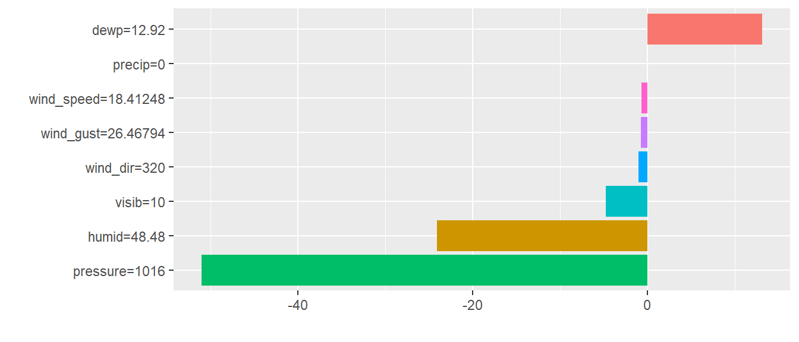
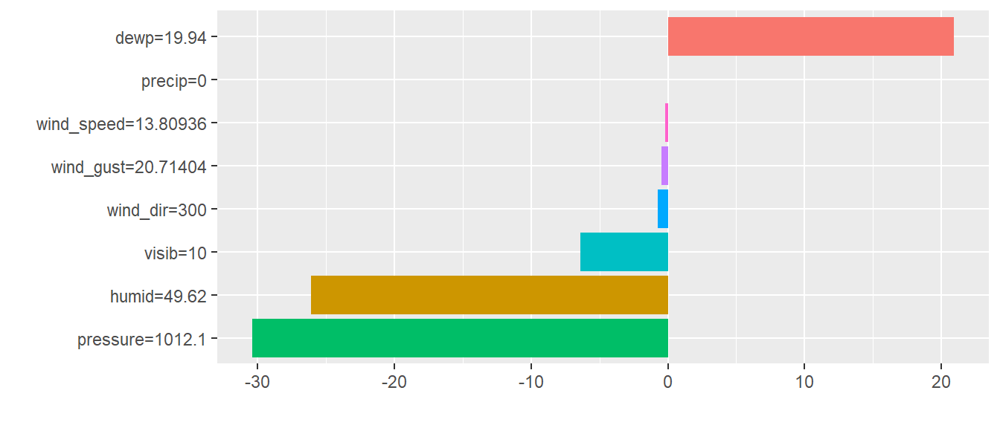
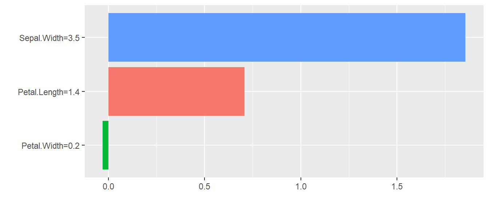

#Substitut local (LIME)
##Définition
Les modèles de substitutions locaux représentent une nouvelle méthode d'interprétabilité qui explique chaque prédiction individuelle lors des traitements de machine learning.  
Cet outil est une spécificité du modèle de substitution global. Ici, en utilisant la méthode LIME on cherche à expliquer bout à bout des prévisions pour tout type d'individu.  
  
La méthode LIME cherche à comprendre pour un ensemble de données pourquoi le modèle de machine learning a fait une certaine prédiction. Ainsi, elle teste pour chaque prédiction ce qu'il se passe lorsque les données sont perturbées/variées.  
De ce fait, elle génère un nouvel ensemble de données perturbées ainsi que les prédictions qu'il en découle pour définir un ensemble d’apprentissage, avec une pondération des instances perturbées sur l'instance d'intérêt en fonction de la proximité avec cette dernière.  
  
On peut noter que cette méthode s'applique sur n'importe quelle méthode de machine learning. Elle présente donc l'explication d'une prédiction locale menant droit à de bonnes approximations locales. En revanche, il peut s'avérer que les approximations ne soient pas bonnes pour un modèle global, cela est défini par "Local fidelity".   
  
Les modèles de substitutions sont exprimés ainsi :
$$
explanation(x) = \arg\max_{g \in G} \ L(f,g,\pi_x) + \Omega(g)
$$ 

##Avantages
Ici, nous nous intéressons uniquement à LIME pour des données tabulaires. Sachez, tout de même, qu’il
existe des algorithmes LIME pour des données textuelles ainsi que pour des images.  
Cette méthode est une des rares pouvant être élargie à différents types de données.  
  
Le "Local Fidelity" est une mesure de précision sur la fiabilité du modèle interprétable. Il sert à expliquer les prédictions locales focalisées sur notre instance d'intérêt.  
  
La méthode LIME est très rapide en coût de calcul, et elle est implémentée sur les logiciels `R` et `Python` dans différents packages. 
On notera que lors de l'utilisation du package `iml`, `R` utilise directement les régressions linéaires lorsque nous appelons la fonction ce qui réduit les temps de calculs et de codes.  


##Inconvénients
La méthode LIME se base sur le choix de noyaux (estimations par densité). Cela implique que son utilisation doit être très contrôlée. En effet, elle nécessite pour chaque application de tester avec plusieurs paramètres de noyaux qui diffèrent afin de voir si les explications apportées s'avèrent être interprétables.  
  
Le "Local Fidelity" peut poser problème dans le cadre d'une analyse globale. Effectivement, nous avons dit précédemment que c'était une mesure fiable pour expliquer les prédictions locales. En revanche, dans sa globalité elle n'est pas forcément parlante et interprétable : ce qui met en évidence le contraste local vs global.  
  
De même que pour les fonctions de permutations, nous avons aussi un problème de corrélations entre variables endogènes puisque de nouvelles instances sont échantillonnées au cours de la procédure. Cela a pour effet de ne pas tenir compte des interactions entres variables corrélées qui constitueront des prédictions sur des ensembles de points de nouveaux incohérents.  
  
Il existe aussi le problème d'instabilité des explications. Les données permutées qui forment l'échantillon d'apprentissage rendent par défaut une explication instable, puisqu'elle ne garantit en rien qu'une fois le processus répété nous obtenons les mêmes résultats.  
  
    
La méthode LIME se trouve être prometteuse dans sa capacité à essayer d'expliquer ce qu'il se déroule dans les boîtes noires, ainsi que pour la compréhension de nos prédictions. Néanmoins, elle reste encore fragile et nécessite d'être bien construite pour renforcer cette méthode prometteuse et de l'appliquer sans soucis.  

##En `R`
En `R`, nous utilisons toujours le package `iml` pour implémenter la méthode LIME.  
Ci-dessous nous pouvons trouver un exemple de code avec pour boite noire une forêt aléatoire :   
```{}
algo_FA = randomForest(formula, data, importance = TRUE)

predictor = Predictor$new(model = algo_FA, data)

lime.explain = LocalModel$new(predictor, x.interest = , k = 8) #k règle le nb de variable

lime.explain$results %>%
  ggplot(aes(x = reorder(feature.value, effect), y = effect, fill = feature.value)) +
    geom_bar(stat = "identity") +
    coord_flip() +
    labs(x="", y="", fill="") +
    theme(legend.position='none')
    
#ou tout simplement : plot(lime.explain)
```
  
Il existe aussi d'autres packages pour implémenter une méthode LIME comme le package `lime`.  
Du coté de `Python`, les méthodes LIME sont intégrés dans `lime`.

##Exemples 
###Exemple 1 : LIME sur le jeu de données `weather` 
On utilise le jeu de données `weather` du package `nycflights13`. Il représente les données météorologiques horaires pour les trois aéroports de New York : EWR, LGA et JFK.  

####Construction de LIME avec comme boite noire une forêt aléatoire {-}   


<div class="figure">

<p class="caption">(\#fig:unnamed-chunk-3)Graphique LIME pour la prédiction de la température des aéroports de New York avec une forêt aléatoire.</p>
</div>
  
Après avoir implémenté notre méthode LIME sur la prédiction de la température des aéroports, il en ressort ce graphique témoignant pour chaque variable explicative les effets de ces dernières, à l'aide des régressions effectuées en amont.  
La barre des abscisses témoigne de l'effet que peut avoir une variable sur $Y$.  
  
Pour ce qui est de la variable `dewp` nous avons un effet/coefficient positif impactant la montée de température lorsque cette dernière augmente aussi.  
  
Pour le reste, seul les variables `pressure`, `humid` et `visib` constituent un impact négatif sur la température lorsqu'elles augmentent. Cela a donc pour effet de diminuer la température dans les aéroports de New-York.  

Quant aux autres variables, LIME a décrété qu'elles n'avaient pas/peu de poids sur la température.  

####Construction de LIME avec comme boite noire l'agorithme des KNN {-}  

<div class="figure">

<p class="caption">(\#fig:unnamed-chunk-4)Graphique LIME pour la prédiction de la température des aéroports de New York avec l'algorithme des KNN.</p>
</div>
  
Nous pensons qu'il est intéressant de comparer deux modèles de boites noires sur le même jeu de données en appliquant la méthode LIME. Nous avons donc procédé à l'algorithme des KNN et à notre grande surprise nous obtenons les mêmes interprétations faites auparavant.  
On peut cependant remarquer que les graphiques ne sont pas totalement égaux. En effet, lorsque l'on utilise la méthode LIME, il faut choisir sur quelle ligne de notre jeu de données nous nous basons (x.interest). Ici, nous avons choisi la première ligne pour l'algorithme des forêts aléatoires. Tandis que pour l'algorithme des KNN, nous avons choisi la troisième ligne : ce qui explique les différences.  
Il est important de retenir que nous obtenons les mêmes interprétations peu importe la ligne choisie et l'algorithme.  

###Exemple 2 : LIME sur le jeu de données `iris` {-}
####Construction de LIME avec comme boite noire une forêt aléatoire {-}   
<div class="figure">

<p class="caption">(\#fig:unnamed-chunk-5)Graphique LIME pour la prédiction de la longueur des sépales d'une fleur avec une forêt aléatoire.</p>
</div>
  
On s’intéresse maintenant au jeu de données `iris`. Nous avons trois variables explicatives.  
Après avoir implémenté notre méthode LIME sur la prédiction de la longueur des sépales, on remarque que seulement `Sepal.Width` et `Petal.Length` possèdent un impact positif sur cette prédiction.  
En revanche, `Petal.Width` n'est pas impliquée sur la prédiction de `Sepal.Lenght`.  


####Construction de LIME avec comme boite noire l'agorithme des KNN {-} 
<div class="figure">

<p class="caption">(\#fig:unnamed-chunk-6)Graphique LIME pour la prédiction de la longueur des sépales d'une fleur avec l'algorithme des KNN.</p>
</div>
  
Ici, nous observons comme précédemment les mêmes interprétations.  
Les graphiques sont totalement égaux, puisque nous avons choisi de prendre en compte les mêmes lignes d'observations.
Grâce à ces deux exemples, on peut dire que peu importe l'algorithme utilisé nous obtiendrons les mêmes résultats et interprétation après l'application de la méthode LIME.


